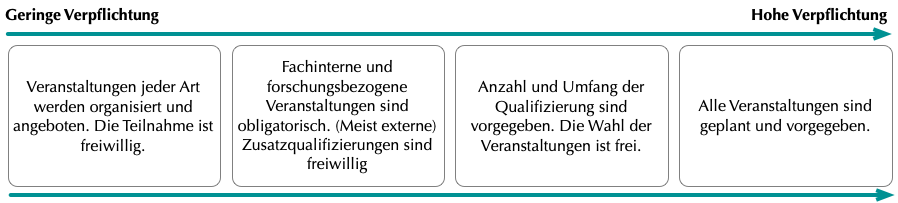

Durch die verstärkte Strukturierung wird die Promotion mehr und mehr als Teil der wissenschaftlichen Ausbildung verstanden. Promotionsprogramme tragen als Nachwuchsfördereinrichtungen einen Teil der institutionellen Verantwortung für die Qualifikation und Kompetenzbildung von Doktorand:innen und Postdocs. Ein zentrales Ziel von GRK-Projekten ist also das Angebot eines Qualifizierungsprogramms. Auf die einzelnen Aspekte des Programms, wie Inhalte, Wirksamkeit, Ablauf, Umfang und Verbindlichkeit wird hier genauer eingegangen.

**Typische fachspezifische Themen und Veranstaltungen**

- Lehrangebot durch beteiligte Wissenschaftler:innen (meist im Rahmen des Kolloquiums oder wöchentliche Seminare)
- Vorträge und Workshops durch Gastwissenschaftler:innen (meist im Rahmen des Kolloquiums)
- Forschungsmethoden
- Sommer/Winterschulen, Klausurtagungen/Retreats
- Lesekreise
- Praktika

**Typische überfachliche Themen**:

- Promotionseinstieg
- Promotionsmanagement/Zeitmanagement/Selbstmanagement
- Techniken und Methoden wissenschaftlichen Schreibens
- Networking, Kommunikations- und Präsentationstechniken, Rhetorik
- Team- und Führungskompetenzen
- Karriereberatung, Vorstellungs- und Bewerbungstrainings
- Wissenschaftliches Schreiben, Methoden/Techniken
- Gute Wissenschaftliche Praxis (GWP, DFG 2013), Recht und Ethik
- Fremdsprachen
- Medientrainings

Eine weitere wichtige Rolle von GRKs ist die Kommunikation existierender Angebote. Im Rahmen von GRK-Projekten wird die Fülle der Weiterbildungsangebote, deren Sichtbarkeit und auch der Anreiz sie zu nutzen entscheidend erhöht.

> Strukturierte Programme erhöhen die Nutzung von Qualifizierungsangeboten tatsächlich deutlich. Die durchschnittliche Anzahl an besuchten Veranstaltungen ist mit 3,6 pro Jahr höher als bei Promovierenden außerhalb solcher Programme, die 2,2-2,4 Veranstaltungen besuchten (Jaksztat et al. 2012:46)

Im Rahmen ihrer akademischen Arbeit sollen Doktorand:innen außerdem **Lehrerfahrung** sammeln sowie Konzepte und Methoden der **Wissenschaftskommunikation**, also der Vermittlung von Wissen an die Öffentlichkeit, kennenlernen. Die Zuständigkeiten für die Einbindung in die Hochschullehre und Betreuung liegen häufig außerhalb eines GRK-Projekts bei den Professor:innen und Instituten. Zur Vermittlung kann hier bei Bedarf der Kontakt hergestellt werden oder im Rahmen der Stakeholderkommunikation auch die Bitte geäußert werden, Doktorand:innen in mögliche Lehrtätigkeiten einzubinden. Projektintern können Anregungen zu Lehr- und Betreuungstätigkeiten im Rahmen der Ausbildung gegeben werden. Dabei ist es wichtig darauf zu achten, dass der Umfang nicht zu hoch ist, und, dass es eine inhaltliche Nähe zum Promotionsprojekt gibt, um Verzögerungen bei der Promotion zu vermeiden.

Für die Gestaltung des Qualifizierungsprogramms stehen viele Inhalte und Formate zur Verfügung. Je aufwändiger in der Organisation oder im Umfang, desto seltener werden bestimmte Veranstaltungen voraussichtlich stattfinden. Während Klausurtagungen und Sommerschulen eher ein- bis zweimal im Jahr stattfinden können, werden Seminare, Vorträge und Kolloquien regelmäßig, oft sogar wöchentlich, organisiert. Der Besuch spezifischer Softskillkurse bekommt neben Veranstaltungsbesuchen von Fach- und Methodenseminaren und der Forschungstätigkeit eher weniger Raum. Sie finden typischerweise anlassbezogen oder je nach Angebotslage statt. Als allgemeine Regel gilt bei der Programmgestaltung: Das Fachspezifische darf nicht vernachlässigt werden.

Einige der typischerweise allgemein angelegten Veranstaltungen lassen sich auch GRK-intern organisieren und so, wenn nötig, stärker mit dem Fach verbinden. Auf diese Weise können für Karriereberatung und Schreibtrainings, zum Beispiel, die Eigenheiten des fachlichen Umfelds berücksichtigt werden und im GRK in vertrauter Umgebung stattfinden.

 **Umfang des Programms und Freiwilligkeit**

Neben der Gestaltung des Qualifizierungskonzepts muss im GRK-Projekt auch entschieden werden, welchen Umfang das Programm hat und ob die Wahrnehmung der Angebote verpflichtend sein soll. Auch diese Aspekte sollten zunächst aus verschiedenen Perspektiven betrachtet werden. 

> Die Wahrnehmung dieser Angebote soll sich […] nicht promotionsverlängernd auswirken“ (HRK 2012:6).

Diese Angaben reichen von 2,6 Stunden bei einer nebenberuflichen Promotion bis zu 5,8 Stunden täglich bei Stipendiat:innen (Jaksztat et al. 2012:60). In ihrem Arbeitsalltag können Promovierende außerdem mit Lehre und Betreuung sowie Organisation und Administration beschäftigt sein. Das betrifft vor allem wissenschaftliche Mitarbeiter:innen, wie sie zum Beispiel in GRK-Projekten von Sonderforschungsbereichen vertreten sind.

Insgesamt sollte der Finanzierungshintergrund bei der Einschätzung der Kapazitäten und der Vorgabe eines Qualifizierungsrahmens berücksichtigt werden. Auf individueller Ebene müssen zum Teil auch persönliche Umstände einbezogen werden, die die verfügbare Arbeitszeit beeinflussen können, zum Beispiel familiäre Verpflichtungen wie Betreuung und Pflege, oder auch nebenberufliches Engagement.

 >Die Untersuchungen der Hans-Böckler-GRKs zum **Umfang** des Programms ergeben: Es sollten maximal 15 Stunden, d.h. etwa zwei Studientage pro Monat für das zusätzliche Programm veranschlagt werden (Böttcher & Krüger 2009 :167). In Promotionsprogrammen sind es etwa drei bis vier regelmäßige verpflichtende Tätigkeiten, die neben der Promotion absolviert werden müssen (Korff 2015:71).
 
 Dazu gehören in erster Linie Doktorandenkolloquien, Publikationen und Tagungsbesuche sowie eigene Vorträge auf Tagungen. Es handelt sich demnach vor allem um fachspezifische Veranstaltungen die zur allgemeinen wissenschaftlichen Praxis gehören. Hier würde für die Forderung nach Verbindlichkeit aller Voraussicht nach eine hohe Akzeptanz unter den GRK-Mitgliedern herrschen. Ein zusätzliches verpflichtendes Kursprogramm könnte die Kapazitäten für die Promotionsarbeit erheblich einschränken und eher zur Überlastung führen. Außerdem ist nicht gewährleistet, dass die Komponenten eines solchen Programms auf jedes Mitglied zugeschnitten sind, denn Interessen, Bedürfnisse und Lernweisen können sehr unterschiedlich sein. Hier besteht die Gefahr, dass Tätigkeiten unnötig verfolgt werden müssen, was wiederum zu fehlender Kooperation im Projekt und zu Unzufriedenheit führen kann. Vielmehr gilt:

>„As one model does not fit all, staff development units are encouraged to offer a variety of training opportunities and training techniques“ (Pinto et al. 2016:76)

Es gibt Hinweise darauf, dass sich zu viel Struktur auch schädlich auf die Promotionsabsicht auswirken kann, weil „_externe_ Promovierende die Angebote ihrer Programme eher als eine Möglichkeit bzw. Chance bewerten, während _interne_ und Promovierende aus (Gemeinschafts-)Programmen diese eher als Verpflichtung wahrnehmen“ (Korff 2015:77-87).

>Zumindest dissertationsferne Tätigkeiten sollten nicht verpflichtend sein ( (vgl. Krempkow 2015)

 Dies wird gestützt durch die hohe Relevanz von fachspezifischen Veranstaltungen eines Promotionsprogramms. Zusätzlich können auch die Nutzung der Projekträumlichkeiten und Gruppentreffen für den Austausch vorgeschrieben werden, um so Gelegenheiten zur Kooperation zu schaffen. Das ist besonders wichtig, wenn an einem GRK mehrere Standorte beteiligt sind (Böttcher & Krüger 2009:153-157). Für fachinterne Veranstaltungen und Formate mit der Gelegenheit zum Austausch kann also eine verbindliche Teilnahme sinnvoll sein, nicht zuletzt auch, weil diese das gesamte Forschungsprogramm unabhängig von der individuellen Entwicklung der Promovierenden voranbringen können.
 
 Mit einer **Mischform** – Verpflichtung für fachspezifische Programmkomponenten, Angebotshaltung und Freiwilligkeit bei Zusatzqualifikationen – kann man die Vorteile der Strukturierung mit denen der freien Promotion verbinden. Auch aus wissenschaftspolitischer Sicht sollten Individualität und Selbstständigkeit die Kultur von GRK-Projekten prägen

 Doktorand:innen sollen als _early stage researchers_, und _professionals_ angesehen werden (Salzburg I [iv], EUA 2005). Die Doktorand:innenausbildung ist per Definition individuell und originell: „The path of progress of the individual is unique, in terms of the research project as well as in terms of the individual professional development“ (Salzburg II, EUA 2010). Auch die HRK meint, dass Selbstständigkeit und Eigenverantwortlichkeit „gefordert und gefördert“ werden müssen (2012:3) und auch seitens der Promovierenden wird ein besonderer Wert auf Autonomie gelegt (Jaksztat et al. 2012:64). Die Angst vor Vorgaben, Verschulung und „kleinteiligen Erfolgskontrollen“ prägen auch die Kritik an der verstärkten Strukturierung der Promotion (ebd:2). 
 In der GRK-Managementpraxis kann dieser Vorwurf mit einer guten Planung und einer transparenten Abwägung des Umfangs und der Verbindlichkeiten des Qualifizierungsprogramms entkräftet werden und die Strukturierung stattdessen zum Vorteil genutzt werden.
 
Im Falle von verpflichtenden Inhalten, sollte insgesamt darauf geachtet werden, dass eine Verschulung der Promotionsphase vermieden wird (UniWiND 2011:7)

 Quellen: Böttcher & Krüger (2009), Jaksztat et al. (2012), Korff (2015), Krempkow (2015), Pinto et al. (2016:76)
 