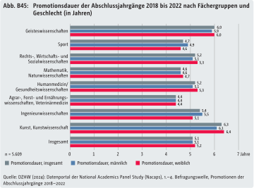
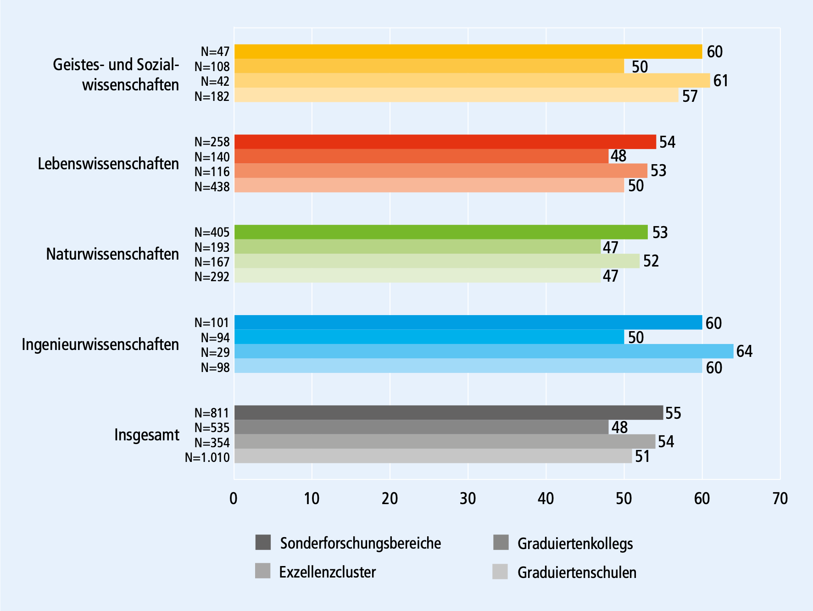

Ihrem Zweck nach ist für GRKs die erfolgreiche Promotion das Haupterfolgskriterium. Das bedeutet für Promovierende im allgemeinen mehr als das Erlangen der wissenschaftlichen Selbstständigkeit:

> *„Eine Promotion soll in Deutschland auf eine wissenschaftliche Laufbahn oder auf die Übernahme verantwortlicher Tätigkeiten in allen anderen Bereichen der Gesellschaft vorbereiten“* (WR 2002:49)

Das politische Oberziel dessen ist die Sicherstellung der Innovations- und Zukunftsfähigkeit des Wissenschaftssystems (HRK 2012:3). GRKs sollen die Kandidat:innen dabei unterstützen, diese Befähigung zu erlangen. Die Promotion und die damit verbundenen politischen Ziele stehen also am Ende eines GRK-Zielsystems. Obwohl das für die Managementpraxis nicht bedeutet, dass dieser Aspekt stets in den Mittelpunkt gestellt werden muss, wird der Erfolg eines GRKs nicht zuletzt an den abgeschlossenen Promotionen bemessen. Es ist also wichtig, die Hintergründe zur Promotionsdauer sowie zu Promotionsabbrüchen zu kennen, um eine sinnvolle Förderung zu betreiben und so den Projekterfolg zu sichern.

Die Beantwortung der folgenden Fragen wird entscheidende Rückschlüsse auf das GRK-Programm und seine Zielsetzung in Bezug auf den Promotionsrahmen geben: Wie lange promovieren Kandidat:innen normalerweise und inwiefern ist die Promotionsdauer abhängig vom fachlichen Umfeld und den allgemeinen Lebensumständen? Welche sind die Hauptgründe für Verzögerungen und Promotionsabbrüche? Hieraus lassen sich für das GRK-Zielsystem Maßnahmen zur Förderung der Promotionsdauer und zur Vermeidung von Promotionsabbrüchen ziehen.

### Promotionsdauer und -motive 

Allein weil es ein wichtiger Bewertungsmaßstab für die externe Evaluation der Geldgeber:innen ist, ist es sinnvoll, die Kenntnis der durchschnittlichen Promotionsdauer, abhängig vom Fachbereich, in die GRK-Zielvorstellungen einfließen zu lassen.

2023 betrug die durchschnittliche Promotionsdauer laut Nacaps 5,1 Jahre – gemessen bis zum Abschluss der Promotion aus Sicht der Befragten. Die Promotionsdauer unterscheidet sich deutlich nach Fachbereich: Sie liegt zwischen 4,4 Jahren in den Agrar-, Forst- und Ernährungswissenschaften sowie der Veterinärmedizin und 6,3 Jahren in Kunst und Kunstwissenschaft. Insgesamt beträgt sie 5,1 Jahre (BuWiK 2025, Abb. B45, basierend auf DZHW/Nacaps-Daten).

! [Link zur Grafik](https://buwik.de/en/interactive-report/section-b/#chart-2586)

**Verbund-spezifische Zahlen**:

 Promotionsdauer nach Wissenschaftsbereich und Programm (Median, in Monaten)(aus DFG 2021)
 

Angesichts der dokumentierten unterschiedlichen Promotionsdauern lohnt es sich, wenn GRK-Leiter:innen und -Manager:innen für die Bewertung der tatsächlichen und die Festlegung der angestrebten Promotionszeit die Zahlen für den jeweiligen Wissenschaftsbereich im Blick haben. Die Zahlen zeigen außerdem, dass es – Stand 2021 – eine deutliche Diskrepanz zwischen der idealen und der tatsächlichen Promotionsdauer gibt. GRKs sollen hier als strukturgebende Einrichtungen Abhilfe schaffen.

>Insbesondere in den Geisteswissenschaften gibt es viele Einzelfälle mit deutlich längeren Promotionsdauern (DFG 2021:15).

Solche statistischen Ausreißer sollten für geisteswissenschaftliche GRKs in die Erwartungen zur Promotionsdauer einbezogen werden.

Zur Ermittlung der Erfolgskriterien von GRKs haben Studien untersucht, welchen Einfluss einzelne Aspekte der Promotionsprogramme der Hans-Böckler-Stiftung auf die Promotionsdauer haben. 
> Von den Faktoren Betreuungssituation, Studienseminare, Ausstattung des Kollegs, Universitätsanbindung (z.B. relevant bei außeruniversitären Forschungseinrichtungen), Mitbestimmung, Beweggründe für die Promotion und Vorarbeit haben nur die letzten beiden einen signifikant verkürzenden Einfluss auf die Promotionsdauer (nach Böttcher & Krüger 2009)

Gerade der fehlende Einfluss der **Betreuungssituation** kritisch gesehen werden darauf zurückgeführt werden, dass die Betreuer:innen die Promotionsdauer nicht ausreichend im Blick haben. Für das GRK-Management bedeutet das, dass dieser Aspekt in der Kommunikation mit den Betreuer:innen aufgegriffen und ihnen, sowie auch den Doktorand:innen, stärker bewusst gemacht werden muss. Siehe [[Betreuung gestalten]].

Der positive Effekt einiger Monate **Vorarbeit** vor einem GRK-Beitritt liegt auf der Hand: Sie verschiebt die Laufzeit nach vorne und wird selbst nicht zwingend zur Promotionszeit gerechnet. Diese Erkenntnis kann im Rahmen des GRK-Stipendienprogramms berücksichtig werden: Setzt man bei der Auswahl der Mitglieder darauf, dass bereits gewisse Vorarbeiten geleistet wurden, zum Beispiel in Form von Literaturrecherche und Exposé-Erstellung, macht es den Promotionsabschluss im Rahmen des GRK realistischer und den Projekterfolg sicherer. Siehe auch [[Promotionsphasen]].

Die **Beweggründe für eine Promotion** beeinflussen die Promotionsdauer ebenfalls positiv. Darauf hat ein GRK-Projekt zwar nur wenig Einfluss, die Motive und ihr möglicher Einfluss auf den Promotionsverlauf können aber in der Praxis mit den Doktorand:innen im Rahmen einer offenen Reflexion besprochen werden. Laut der NACAP-Studie sind spannende Promotionsinhalte, der Spaß an der Forschung selbst und die hohe persönliche Bedeutung der Promotion für den Promotionsstart die wichtigsten Motive, gefolgt von Karriere und Selbstbeweis, Selbstbild und Anerkennung, sowie Lebensunterhalt und schlechtem Gewissen.

Die Beweggründe für eine Promotion lassen sich grob in drei Motivtypen unterscheiden:

- **Intrinsische Motivation**: Interesse an Wissenschaft und Forschung
- **Instrumentelle Motivation**: Nutzen und berufliche Verwertbarkeit des Promotion
- **Promotion als Ausweg** wegen eines Mangels an Alternativen

**Allgemeine Empfehlungen**

Das Management sollte die aktuellen Zahlen zur Promotionsdauer stets im Blick haben und die Promotionszeiten der Doktorand:innen im Projekt regelmäßig erfassen – möglicherweise sogar mit einzelnen Entwicklungsstufen [[Promotionsphasen]]. Eine Besonderheit, die es bei der Dokumentation zu berücksichtigen gilt, sind die vielfältigen Möglichkeiten zur **Angabe des Promotionsbeginns und des Promotionsendes** [Dokumentation, Reporting, Monitoring und Evaluation].

### Promotionsabbrüche

[Quellen](../Literatur%20und%20Links/):  Böttcher & Krüger 2009, HRK (2012:3) , BuWiK 2025 (Abschnitt B3)

