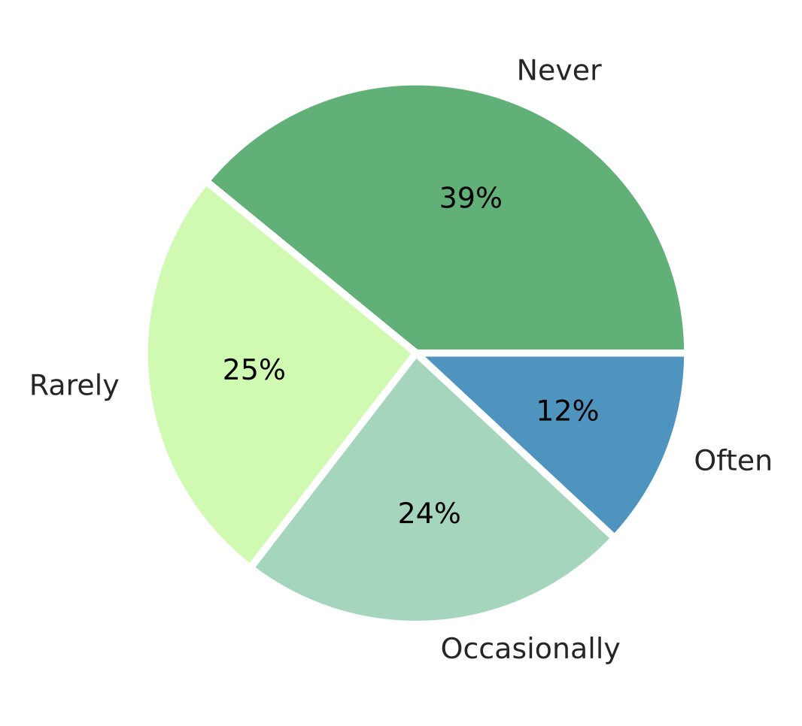

Ihrem Zweck nach ist für GRKs die erfolgreiche Promotion das Haupterfolgskriterium. Das bedeutet für Promovierende im allgemeinen mehr als das Erlangen der wissenschaftlichen Selbstständigkeit:

> *„Eine Promotion soll in Deutschland auf eine wissenschaftliche Laufbahn oder auf die Übernahme verantwortlicher Tätigkeiten in allen anderen Bereichen der Gesellschaft vorbereiten“* (WR 2002:49)

Das politische Oberziel dessen ist die Sicherstellung der Innovations- und Zukunftsfähigkeit des Wissenschaftssystems (HRK 2012:3). GRKs sollen die Kandidat:innen dabei unterstützen, diese Befähigung zu erlangen. Die Promotion und die damit verbundenen politischen Ziele stehen also am Ende eines GRK-Zielsystems. Obwohl das für die Managementpraxis nicht bedeutet, dass dieser Aspekt stets in den Mittelpunkt gestellt werden muss, wird der Erfolg eines GRKs nicht zuletzt an den abgeschlossenen Promotionen bemessen. Es ist also wichtig, die Hintergründe zur Promotionsdauer sowie zu Promotionsabbrüchen zu kennen, um eine sinnvolle Förderung zu betreiben und so den Projekterfolg zu sichern.

Die Beantwortung der folgenden Fragen wird entscheidende Rückschlüsse auf das GRK-Programm und seine Zielsetzung in Bezug auf den Promotionsrahmen geben: Wie lange promovieren Kandidat:innen normalerweise und inwiefern ist die Promotionsdauer abhängig vom fachlichen Umfeld und den allgemeinen Lebensumständen? Welche sind die Hauptgründe für Verzögerungen und Promotionsabbrüche? Hieraus lassen sich für das GRK-Zielsystem Maßnahmen zur Förderung der Promotionsdauer und zur Vermeidung von Promotionsabbrüchen ziehen.

### Promotionsdauer und -motive 

Allein weil es ein wichtiger Bewertungsmaßstab für die externe Evaluation der Geldgeber:innen ist, ist es sinnvoll, die Kenntnis der durchschnittlichen Promotionsdauer, abhängig vom Fachbereich, in die GRK-Zielvorstellungen einfließen zu lassen.

2023 betrug die durchschnittliche Promotionsdauer laut Nacaps 5,1 Jahre – gemessen bis zum Abschluss der Promotion aus Sicht der Befragten. Die Promotionsdauer unterscheidet sich deutlich nach Fachbereich: Sie liegt zwischen 4,4 Jahren in den Agrar-, Forst- und Ernährungswissenschaften sowie der Veterinärmedizin und 6,3 Jahren in Kunst und Kunstwissenschaft. Insgesamt beträgt sie 5,1 Jahre (BuWiK 2025, Abb. B45, basierend auf DZHW/NACAPS-Daten). [Link zur Grafik](https://buwik.de/en/interactive-report/section-b/#chart-2586)* Quelle: DZHW (2024), Datenportal der National Academics Panel Study (Nacaps), zitiert nach BuWiK 2025, Abb. B45*

**Verbund-spezifische Zahlen**:

 Promotionsdauer nach Wissenschaftsbereich und Programm (Median, in Monaten)(aus DFG 2021):
 
 

 Angesichts der dokumentierten unterschiedlichen Promotionsdauern lohnt es sich, wenn GRK-Leiter:innen und -Manager:innen für die Bewertung der tatsächlichen und die Festlegung der angestrebten Promotionszeit die Zahlen für den jeweiligen Wissenschaftsbereich im Blick haben. Die Zahlen zeigen außerdem, dass es – Stand 2021 – eine deutliche Diskrepanz zwischen der idealen und der tatsächlichen Promotionsdauer gibt. GRKs sollen hier als strukturgebende Einrichtungen Abhilfe schaffen.

>Insbesondere in den Geisteswissenschaften gibt es viele Einzelfälle mit deutlich längeren Promotionsdauern (DFG 2021:15).

Solche statistischen Ausreißer sollten für geisteswissenschaftliche GRKs in die Erwartungen zur Promotionsdauer einbezogen werden.

Zur Ermittlung der Erfolgskriterien von GRKs haben Studien untersucht, welchen Einfluss einzelne Aspekte der Promotionsprogramme der Hans-Böckler-Stiftung auf die Promotionsdauer haben. 
> Von den Faktoren Betreuungssituation, Studienseminare, Ausstattung des Kollegs, Universitätsanbindung (z.B. relevant bei außeruniversitären Forschungseinrichtungen), Mitbestimmung, Beweggründe für die Promotion und Vorarbeit haben nur die letzten beiden einen signifikant verkürzenden Einfluss auf die Promotionsdauer (nach Böttcher & Krüger 2009)

Gerade der fehlende Einfluss der **Betreuungssituation** kritisch gesehen werden darauf zurückgeführt werden, dass die Betreuer:innen die Promotionsdauer nicht ausreichend im Blick haben. Für das GRK-Management bedeutet das, dass dieser Aspekt in der Kommunikation mit den Betreuer:innen aufgegriffen und ihnen, sowie auch den Doktorand:innen, stärker bewusst gemacht werden muss. Siehe [[Betreuung gestalten]].

Der positive Effekt einiger Monate **Vorarbeit** vor einem GRK-Beitritt liegt auf der Hand: Sie verschiebt die Laufzeit nach vorne und wird selbst nicht zwingend zur Promotionszeit gerechnet. Diese Erkenntnis kann im Rahmen des GRK-Stipendienprogramms berücksichtig werden: Setzt man bei der Auswahl der Mitglieder darauf, dass bereits gewisse Vorarbeiten geleistet wurden, zum Beispiel in Form von Literaturrecherche und Exposé-Erstellung, macht es den Promotionsabschluss im Rahmen des GRK realistischer und den Projekterfolg sicherer. Siehe auch [[Promotionsphasen]].

Die **Beweggründe für eine Promotion** beeinflussen die Promotionsdauer ebenfalls positiv. Darauf hat ein GRK-Projekt zwar nur wenig Einfluss, die Motive und ihr möglicher Einfluss auf den Promotionsverlauf können aber in der Praxis mit den Doktorand:innen im Rahmen einer offenen Reflexion besprochen werden. Laut der NACAP-Studie sind spannende Promotionsinhalte, der Spaß an der Forschung selbst und die hohe persönliche Bedeutung der Promotion für den Promotionsstart die wichtigsten Motive, gefolgt von Karriere und Selbstbeweis, Selbstbild und Anerkennung, sowie Lebensunterhalt und schlechtem Gewissen.

Die Beweggründe für eine Promotion lassen sich grob in drei Motivtypen unterscheiden:

- **Intrinsische Motivation**: Interesse an Wissenschaft und Forschung
- **Instrumentelle Motivation**: Nutzen und berufliche Verwertbarkeit des Promotion
- **Promotion als Ausweg** wegen eines Mangels an Alternativen

**Allgemeine Empfehlungen**

- Das Management sollte die aktuellen **Zahlen zur Promotionsdauer stets im Blick haben** und die Promotionszeiten der Doktorand:innen im Projekt regelmäßig erfassen – möglicherweise sogar mit einzelnen Entwicklungsstufen [[Promotionsphasen]]. Eine Besonderheit, die es bei der Dokumentation zu berücksichtigen gilt, sind die vielfältigen Möglichkeiten zur **Angabe des Promotionsbeginns und des Promotionsendes** [Dokumentation, Reporting, Monitoring und Evaluation].
- Neben dem Monitoring der Promotionsverläufe kann ein GRK in seiner Funktion als Serviceprojekt bis zu einem gewissen Grad auch Einfluss auf die Promotionsdauer nehmen. Sie können die nötige **Unterstützung für den Einstieg in die Promotion** bieten, indem sie die Voraussetzungen der Fakultät für eine Promotion und die Anforderungen zur Einschreibung den Betroffenen kommunizieren und entsprechende Unterlagen und Checklisten bereitstellen. Da sich Bedingungen, wie zum Beispiel Leistungsnachweise, Promotionsordnungen, Fristen, oder Anforderungen zur Betreuung, im Laufe der Zeit ändern können, empfiehlt es sich, sich mit den relevanten Fakultäten/Fachbereichen abzusprechen. Auch wenn die formalen Prozesse und der Einstieg ins Forschungsprojekt in erster Linie selbstständig durchlaufen werden, ist es im Interesse des GRK die Projektmitglieder bei der Reflexion, der Bildung der Fragestellung und der Fertigstellung des Exposés zu unterstützen, z.B. durch das Angebot von Vorlagen, Beispielen und Hinweisen oder die Weitergabe von Literaturempfehlungen zum Einstieg und zur Gestaltung der Promotion. Einige zentrale Graduierteneinrichtungen bieten auch Workshops speziell für den Einstieg in die Promotionsphase an.
- 
### Promotionsabbrüche

Ein weiteres Ziel der Strukturierung der Promotion, neben der Verkürzung der Promotionszeit, ist die Verringerung der Abbruchquote.

Befragungen haben gezeigt, dass der Anteil der Promovierenden, die **Abbruchgedanken** haben, mit 43% sehr hoch ist. Die Aufschlüsselung nach Promotions- und Beschäftigungskontext ergibt, dass solche Gedanken bei Promovierenden mit Stipendium, bei frei Promovierenden und bei Promovierenden in strukturierten Programmen tatsächlich seltener vorkom-men (31-38%), als bei wissenschaftlichen Mitarbeitern an Forschungs-projekten und Lehrstühlen (jeweils 47%). Die Abbruchgedanken steigen nach einer Promotionsdauer von mehr als drei Jahren von 41% auf 51% an (Jaksztat et al. 2012:48).

Die NACAP-Studie berücksichtigt bei den Befragungen neben dem Vorkom-men auch die Häufigkeit der Abbruchgedanken, was die Lage etwas anders aussehen lässt: 3% der Befragten gaben an, ständig über den Promotionsabbruch nachzudenken und 9% gaben an, oft darüber nachzudenken. Die Mehrheit denkt gelegentlich (22%) bis selten (31%) über einen Abbruch nach, der größte Teil der Befragten nie (35%) (Kohorte 2021/2022).

Auf der entsprechenden NACAPS-Seite lassen sich die Zahlen noch Differenzieren nach Geschlecht, Fächergruppe, Migrationshintergrund, Strukturiertes Programm, Bildungsherkunft, Elternschaft, Beschäftigung Promovierender: https://nacaps-datenportal.de/indikatoren/D2.html.
Sehr ähnliche Ergebnisse liefert die _2019 Leibniz PhD Survey_, die mit Promotionsstudierenden der Leibniz-Gemeinschaft durchgeführt wird.

**Have you ever considered quitting your PhD?** (n = 820). (Delgado-Osorio, X. et al. 2023:12)

Die Zahlen deuten insgesamt darauf hin, dass Abbruchgedanken zwar bei einem sehr großen Teil der Promovierenden vorkommen, aber nicht in gleichem Maße. Das tatsächliche Risiko ist deshalb nur schwer einzuschätzen. Die Promotion stellt als Individualprojekt zum Nachweis herausragender Forschung eine besonders große Herausforderung für Nachwuchswissenschaftler dar, sodass Abbruchgedanken an sich erwartbar sind und zunächst keine Gefahr darstellen. Sie sind außerdem nicht per se als Misserfolg für Kandidat:innen und die jeweiligen Einrichtungen zu verbuchen. Wenn sie allerdings langanhaltend und zur Blockade werden, zum Beispiel nach längerer Promotionsdauer, kann Krisenhilfe im Rahmen eines GRK-Projekts sinnvoll und notwendig sein.

Interessant ist sicherlich auch, dass man hier das Alter der Promovierenden im Blick haben sollte: Die **Altersverteilung** zeigt, dass eine mit 25 Jahren begonnene Promotion die höchste Abschlusswahrscheinlichkeit hat (89,4% werden abgeschlossen). Bei einem Promotionsbeginn mit 35 Jahren oder später sinkt der Abschlussanteil erheblich ab (56%) (DFG 2021b:19-20). Man kann davon ausgehen, dass diese Verteilung mit altersbegleitenden Lebensumständen zusammenhängt.

Besonders interessant für die GRK-Projektzielsetzung, also für die Vermeidung von Promotionsabbrüchen, sind vor allem die potentiellen **Abbruchgründe**. Liegen sie im Handlungsrahmen eines GRK, sollten sie entsprechend Berücksichtigung finden.
- Befragung von Jaksztat et al. (2012): Häufigste Gründe sind Zweifel an der Eignung und die Arbeitsbelastung im Wissenschaftssystem, gefolgt von mangelnder Betreuung und einem schwer realisier-barem und nicht passendem Thema
- Korff 2015: Die Faktoren Geschlecht, emotionale Stabilität, Karrierepläne, Betreuungsfrequenz und die Zahl verpflichtender Tätigkeiten neben der Pro-motion haben einen signifikanten Einfluss auf Abbruchgedanken
- NACAPS: Gesundheitliche Probleme und Vereinbarkeit mit der Familie spielen _seltener_ eine Rolle als Arbeitsbelastung, Betreuung, Zweifel an Eignung und Realisierbarkeit des Themas
- Delgado-Osorio, X. (2023)/Leibnitz PhD Network): "do not feel qualified enough, career perspectives are unattractive and cannot cope with the high workload"

GRK-Projekte sollen als strukturgebende Programme Einfluss auf die Ursachen von Abbrüchen und Abbruchgedanken haben.

**Empfehlungen nach S. Korff (2015):**

- Teamentwicklung für die Neubildung einer Gruppe
- Ziele für die Gruppe sowie Individualziele ausformulieren
- Organisationsaufgaben verteilen oder Koordinator:innen einsetzen
- Karriereberatung und Mentor:innenprogramm anbieten
- Neutrale (Krisen- und Konflikt-) Beratung zur Verfügung stellen

Für die Vermeidung und Reduzierung der Abbruchrisiken ist weniger das Vorhandensein einer Aus-bildungsstruktur entscheidend als die Prüfung der Promotionsmotive und Fähigkeiten, die Reflexion des Verlaufs, geprägt durch Offenheit und Transparenz, sowie die aktive Unterstützung der Promo-vierenden in organisatorischen und persönlichen Belangen.

[Quellen](../Literatur%20und%20Links/):  Böttcher & Krüger 2009, HRK (2012:3), Jaksztat et al. 2012, Korff (2015), DFG (2021), DFG (2021b), BuWiK (2025), *Literaturempfehlungen für den Einstieg in die Promotion*: z.B. das GEW-Handbuch von Günauer et al. 2012, QZP 2019, Delgado-Osorio, X (2023)

