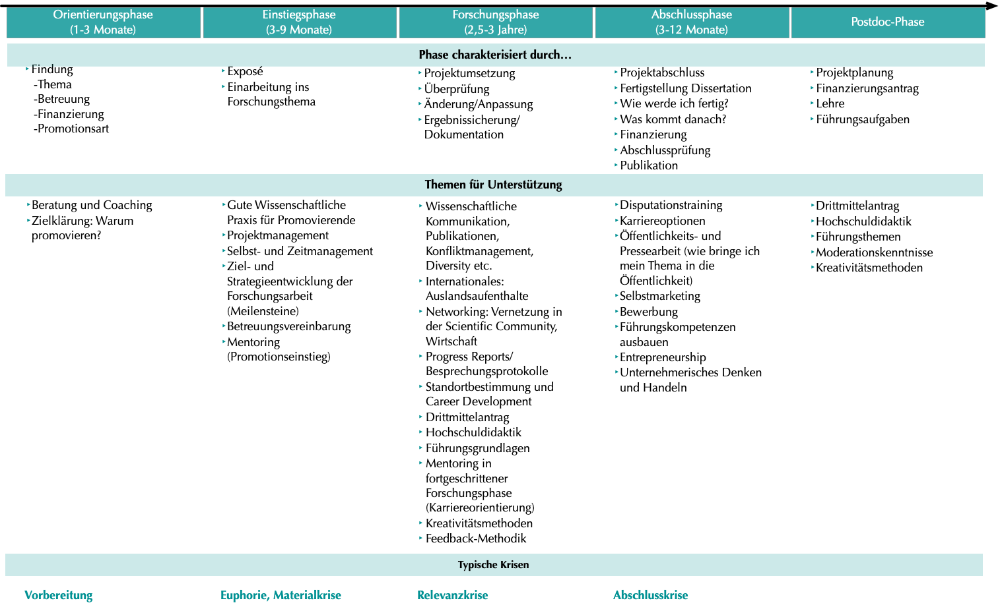

Die Ausführungen zu den möglichen Inhalten und zur Form eines Qualifizierungsprogramms im GRK zeigen, dass viele Themenbereiche abzudecken sind, um die gewünschten Kompetenzen im Rahmen der Promotion vermitteln zu können und die Doktorand:innen ausreichend auf den Arbeitsmarkt vorzubereiten. Eine gute Möglichkeit, die Themen in einen zeitlichen Ablauf zu bringen, ist die Orientierung an Promotionsphasen, denn viele Qualifizierungsinhalte können erst in bestimmten Zeiträumen sinnvoll vermittelt und eingesetzt werden. Zum Beispiel rückt das Thema Karriere tendenziell nach der Hauptbearbeitungszeit der Promotion in den Vordergrund, Methodentrainings finden zu Beginn der Forschungsarbeit statt und Schreibtrainings vor und während der Hauptschreibphase. Die klassischen Promotionsphasen,  angelehnt an Vurgun (2016), sind hier illustriert:

 Klassische Promotionsphasen, angelehnt an Vurgun (2016)

Entlang dieser Phasen können an Kohorten orientierte GRKs ihr Qualifizierungsprogramm ausrichten. Dieses Vorgehen hängt auch mit der Idee zusammen, dass bestimmte Kenntnisse und Fähigkeiten erst in bestimmten Phasen wirksam werden. Hierfür hat Vurgun eine Übersicht über phasentypische Herausforderungen, Krisen und Kompetenzen erstellt:

Die Abbildung zeigt einen Überblick über Phasen der Promotion, deren Charakteristika, Themen für Unterstützung und typische Herausforderungen bzw. Krisen während dieser Phasen (aus Vurgun 2012:18; die Krisen sind übernommen aus Fiedler & Hebecker, 2005).

Die Übersicht zeigt, welche Bedarfe und Krisen im Verlauf der Promotion aufkommen können, woraus sich wiederum ablesen lässt, welche Kompetenzen jeweils gefragt sind und im Rahmen eines Qualifizierungsprogramms gefördert werden könnten. Obwohl es an einigen Stellen fachspezifische Unter-schiede geben wird, bietet eine solche Phasencharakterisierung einen guten Überblick für GRK-Koordinator:innen, und sie kann außerdem im Rahmen der konzeptuellen Arbeit beliebig angepasst werden.

Die Berücksichtigung der Promotionsphasen und die entsprechende Terminierung und Ausgestaltung der Qualifizierungsangebote kann die Wirksamkeit der vermittelten Inhalte und Trainings erhöhen. Dadurch die sind sie stärker mit tatsächlichen Arbeitserfahrung verbunden und gleichzeitig steigt die Bereitschaft der Promovierenden die Angebote in Anspruch zu nehmen.

Quellen: Fiedler & Hebecker (2005), Vurgun (2012)